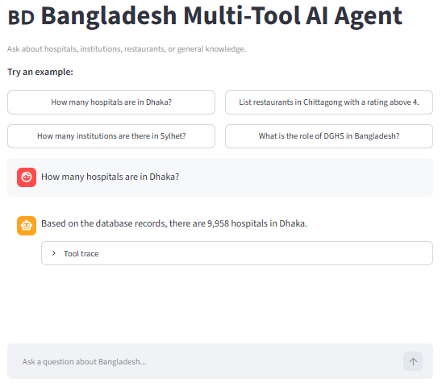
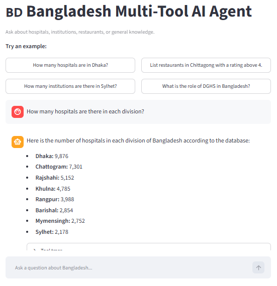
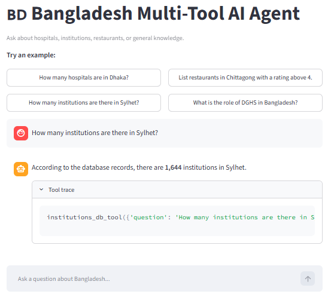
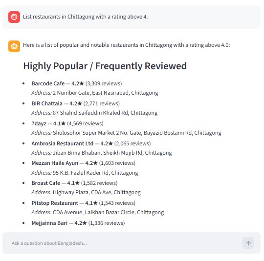
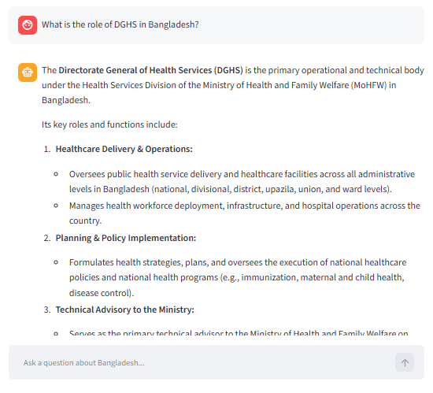
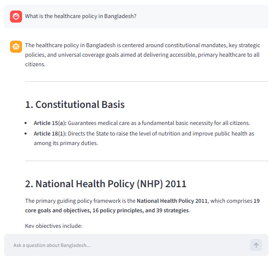

# 🇧🇩 Bangladesh Multi-Tool AI Agent

[](https://github.com/ShaifulPalash/bangladesh-multi-tool-agent/actions/workflows/ci.yml)


> A LangChain/LangGraph-based multi-tool AI agent that answers Bangladesh-focused questions by intelligently routing each query to the appropriate SQLite database or web-search tool.

---

## 📖 Table of Contents

* [Overview](#-overview)
* [Key Features](#-key-features)
* [Architecture](#-architecture)
* [How It Works](#-how-it-works)
* [Technology Stack](#-technology-stack)
* [Datasets](#-datasets)
* [Project Structure](#-project-structure)
* [Installation](#-installation)

  * [1. Clone the Repository](#1-clone-the-repository)
  * [2. Create a Virtual Environment](#2-create-a-virtual-environment)
  * [3. Install Dependencies](#3-install-dependencies)
  * [4. Configure Environment Variables](#4-configure-environment-variables)
  * [5. Download and Inspect Datasets](#5-download-and-inspect-datasets)
  * [6. Build the SQLite Databases](#6-build-the-sqlite-databases)
* [Usage](#-usage)

  * [CLI](#command-line-interface-cli)
  * [Streamlit Web Interface](#streamlit-web-interface)
  * [Example Queries](#example-queries)
* [Database Tools](#-database-tools)
* [Web Search Tool](#-web-search-tool)
* [SQL Safety](#-sql-safety)
* [Screenshots](#-screenshots)
* [Testing](#-testing)
* [Development Workflow](#-development-workflow)
* [Colab / Jupyter Notebook](#-colab--jupyter-notebook)
* [Docker](#-docker)
* [Gemini Free-Tier Quota](#-gemini-free-tier-quota)
* [Limitations](#-limitations)
* [Future Improvements](#-future-improvements)
* [Current Project Status](#-current-project-status)
* [Learning Objectives](#-learning-objectives)
* [Author](#-author)
* [License](#-license)

---

# 📌 Overview

**Bangladesh Multi-Tool AI Agent** is an AI-powered question-answering system designed to work with Bangladesh-focused structured datasets and general web knowledge.

The project uses **Google Gemini 3.6 Flash** as the large language model and **LangChain/LangGraph** to build an agent capable of selecting the appropriate tool for a user's question.

The agent has access to four tools:

| Tool                   | Purpose                                    | Data Source   |
| ---------------------- | ------------------------------------------ | ------------- |
| `institutions_db_tool` | Query Bangladesh institutional information | SQLite        |
| `hospitals_db_tool`    | Query Bangladesh hospital information      | SQLite        |
| `restaurants_db_tool`  | Query Bangladesh restaurant information    | SQLite        |
| `web_search_tool`      | Answer general/current knowledge questions | Tavily / DDGS |

The agent determines which tool to use based on the user's question rather than relying on application-level hard-coded `if/else` routing.

---

# ✨ Key Features

* 🤖 **LLM-powered agent routing**
* 🧠 **Google Gemini 3.6 Flash**
* 🔗 **LangChain tool integration**
* 🕸️ **LangGraph agent orchestration**
* 🏛️ **Bangladesh institutional database**
* 🏥 **Bangladesh hospitals database**
* 🍽️ **Bangladesh restaurants database**
* 🔎 **Tavily web search integration**
* 🦆 **DDGS/DuckDuckGo fallback search**
* 🗄️ **SQLite database backend**
* 🔐 **Read-only SQL safety layer**
* 💬 **Interactive Streamlit chat interface**
* 💻 **Command-line interface**
* 📓 **Jupyter/Google Colab notebook**
* 🧪 **Automated testing with Pytest**
* 🔍 **Ruff linting**
* ⚙️ **GitHub Actions CI**
* 🔑 **Environment-variable based API key management**
* 📸 **Streamlit demonstration screenshots**
* 📦 **Reproducible installation through `requirements.txt`**

---

# 🏗️ Architecture

```text
                         ┌─────────────────────┐
                         │    User Question    │
                         └──────────┬──────────┘
                                    │
                                    ▼
                         ┌─────────────────────┐
                         │   LangGraph Agent   │
                         │   Gemini 3.6 Flash  │
                         └──────────┬──────────┘
                                    │
                           Tool Selection
                                    │
              ┌─────────────────────┼─────────────────────┐
              │                     │                     │
              ▼                     ▼                     ▼
   ┌──────────────────┐  ┌──────────────────┐  ┌──────────────────┐
   │ Institutions DB  │  │   Hospitals DB   │  │ Restaurants DB   │
   │      Tool        │  │       Tool       │  │       Tool       │
   └────────┬─────────┘  └────────┬─────────┘  └────────┬─────────┘
            │                     │                     │
            └─────────────────────┼─────────────────────┘
                                  │
                                  ▼
                         ┌──────────────────┐
                         │ SQLite Databases │
                         └────────┬─────────┘
                                  │
                                  ▼
                           Database Result
                                  │
                                  ▼
                         Natural-Language Answer


                    General Knowledge Questions
                                  │
                                  ▼
                         ┌──────────────────┐
                         │ Web Search Tool  │
                         └────────┬─────────┘
                                  │
                         ┌────────┴────────┐
                         ▼                 ▼
                      Tavily              DDGS
                     Primary             Fallback
                         │                 │
                         └────────┬────────┘
                                  ▼
                           Search Results
                                  │
                                  ▼
                         Gemini 3.6 Flash
                                  │
                                  ▼
                           Final Answer
```

---

# 🔄 How It Works

## End-to-End Data Pipeline

The structured-data pipeline is:

```text
Hugging Face Dataset
        │
        ▼
download_and_inspect.py
        │
        ▼
data/*.csv
        │
        ▼
build_databases.py
        │
        ▼
SQLite Databases
        │
        ├── institutions.db
        ├── hospitals.db
        └── restaurants.db
        │
        ▼
Database Tools
        │
        ▼
LangGraph Agent
        │
        ▼
Natural-Language Answer
```

---

## Database Question Flow

For a question such as:

```text
How many hospitals are in Dhaka?
```

the application follows this process:

```text
User Question
      │
      ▼
Gemini 3.6 Flash
      │
      ▼
Select hospitals_db_tool
      │
      ▼
Generate SQL
      │
      ▼
SQL Safety Validation
      │
      ▼
Read-only SQLite Query
      │
      ▼
Database Result
      │
      ▼
Gemini summarizes result
      │
      ▼
Final Answer
```

---

## Web Search Question Flow

For a question such as:

```text
What is the role of the DGHS in Bangladesh?
```

the application follows this process:

```text
User Question
      │
      ▼
Gemini 3.6 Flash
      │
      ▼
Select web_search_tool
      │
      ▼
Tavily Search
      │
      ├── Success → Use Tavily results
      │
      └── Failure
             │
             ▼
           DDGS
      │
      ▼
Search Results
      │
      ▼
Gemini 3.6 Flash
      │
      ▼
Final Answer
```

---

# 🧰 Technology Stack

## AI / Agent

| Technology              | Purpose                                                             |
| ----------------------- | ------------------------------------------------------------------- |
| Google Gemini 3.6 Flash | LLM for reasoning, routing, SQL generation, and response generation |
| LangChain               | LLM and tool integration                                            |
| LangGraph               | Agent orchestration and tool routing                                |

## Data

| Technology            | Purpose                    |
| --------------------- | -------------------------- |
| SQLite                | Local structured databases |
| Pandas                | Data processing            |
| Hugging Face Datasets | Dataset loading            |
| Hugging Face Hub      | Dataset access             |

## Web Search

| Technology | Purpose                      |
| ---------- | ---------------------------- |
| Tavily     | Primary web-search provider  |
| DDGS       | DuckDuckGo fallback provider |

## Interface

| Technology      | Purpose                                   |
| --------------- | ----------------------------------------- |
| Streamlit       | Browser-based user interface              |
| Python CLI      | Terminal-based interface                  |
| Jupyter / Colab | Interactive development and demonstration |

## Development

| Technology     | Purpose                         |
| -------------- | ------------------------------- |
| Pytest         | Automated testing               |
| Ruff           | Linting                         |
| GitHub Actions | Continuous integration          |
| python-dotenv  | Environment-variable management |

---

# 📊 Datasets

The project uses three Bangladesh-focused public datasets.

## 🏛️ Institutional Information

Dataset:

```text
Mahadih534/Institutional-Information-of-Bangladesh
```

The downloaded dataset contains approximately **34,901 records** and includes fields related to:

* Institution name
* Institution type
* Division
* District
* Thana
* Union
* Management type
* Student type
* Education level
* Affiliation
* MPO status

---

## 🏥 Hospitals

Dataset:

```text
Mahadih534/all-bangladeshi-hospitals
```

The downloaded dataset contains approximately **38,886 records**.

Relevant fields include:

```text
Id
Name
Name (Bangla)
Code
Agency
Type
Division
District
City Corporation
Upazila
Paurasava
Union
Private
```

These fields allow the agent to answer questions involving hospital counts, locations, types, agencies, and private/public classification.

---

## 🍽️ Restaurants

Dataset:

```text
Mahadih534/Bangladeshi-Restaurant-Data
```

The downloaded dataset contains approximately **12,703 records**.

Relevant fields include:

```text
place_id
name
latitude
longitude
rating
number_of_reviews
affluence
address
```

These fields allow the agent to answer questions involving restaurant names, ratings, reviews, locations, and addresses.

---

# 📁 Project Structure

```text
bangladesh-multi-tool-agent/
│
├── .github/
│   └── workflows/
│       └── ci.yml
│
├── agent/
│   └── main_agent.py
│
├── data/
│   ├── institutions.csv
│   ├── hospitals.csv
│   └── restaurants.csv
│
├── db/
│   ├── institutions.db
│   ├── hospitals.db
│   └── restaurants.db
│
├── screenshots/
│   ├── hospitals_db_demo_1.png
│   ├── hospitals_db_demo_2.png
│   ├── institutions_db_demo.png
│   ├── restaurants_db_demo.png
│   ├── web_search_db_demo_1.png
│   └── web_search_db_demo_2.png
│
├── scripts/
│   ├── download_and_inspect.py
│   ├── build_databases.py
│   └── test_queries.py
│
├── tests/
│   ├── test_sql_safety.py
│   └── test_build_databases.py
│
├── tools/
│   ├── db_tools.py
│   ├── sql_safety.py
│   └── web_search_tool.py
│
├── .env.example
├── .gitignore
├── Dockerfile
├── docker-compose.yml
├── entrypoint.sh
├── main.py
├── Makefile
├── pyproject.toml
├── requirements.txt
├── requirements-dev.txt
├── streamlit_app.py
├── Bangladesh_Multi_Tool_Agent.ipynb
└── README.md
```

> `.env` is intentionally not listed because it contains local secrets and should remain ignored by Git.

### 📂 Directory Responsibilities

| Directory / File                    | Responsibility                                                       |
| ----------------------------------- | -------------------------------------------------------------------- |
| `agent/`                            | Main LangGraph agent and routing configuration                       |
| `tools/`                            | Database, SQL-safety, and web-search tools                           |
| `scripts/`                          | Dataset downloading, inspection, database creation, and live queries |
| `tests/`                            | Automated tests                                                      |
| `data/`                             | Downloaded CSV datasets                                              |
| `db/`                               | Generated SQLite databases                                           |
| `screenshots/`                      | Streamlit demonstration screenshots                                  |
| `main.py`                           | CLI application entry point                                          |
| `streamlit_app.py`                  | Streamlit web interface                                              |
| `requirements.txt`                  | Runtime dependencies                                                 |
| `.env.example`                      | Environment-variable template                                        |
| `pyproject.toml`                    | Project and Ruff configuration                                       |
| `.github/workflows/ci.yml`          | GitHub Actions CI pipeline                                           |
| `Bangladesh_Multi_Tool_Agent.ipynb` | Colab/Jupyter workflow                                               |

---

# ⚙️ Installation

## 1. Clone the Repository

```bash
git clone https://github.com/ShaifulPalash/bangladesh-multi-tool-agent.git
cd bangladesh-multi-tool-agent
```

---

## 2. Create a Virtual Environment

### Linux / macOS / WSL

```bash
python3 -m venv .venv
source .venv/bin/activate
```

### Windows

```powershell
python -m venv .venv
.venv\Scripts\activate
```

Verify Python:

```bash
python --version
```

Python **3.12+** is recommended for the current project setup.

---

## 3. Install Dependencies

```bash
pip install -r requirements.txt
```

The project uses the following core dependencies:

```text
langchain
langchain-community
langchain-openai
langgraph
langchain-google-genai
datasets
huggingface_hub
pandas
SQLAlchemy
langchain-tavily
tavily-python
ddgs
python-dotenv
streamlit
```

> `langchain-openai` remains in the current `requirements.txt`, but the application itself uses **Google Gemini**, not OpenAI, as its LLM provider.

---

## 4. Configure Environment Variables

Create `.env` from the example file.

### Linux / macOS / WSL

```bash
cp .env.example .env
```

### Windows

```powershell
copy .env.example .env
```

Then edit `.env`:

```dotenv
# Google Gemini API key
GEMINI_API_KEY=your_gemini_api_key_here

# Agent model
AGENT_MODEL=gemini-3.6-flash

# Tavily API key
TAVILY_API_KEY=your_tavily_api_key_here
```

### Environment Variables

| Variable         | Required    | Purpose                        |
| ---------------- | ----------- | ------------------------------ |
| `GEMINI_API_KEY` | Yes         | Google Gemini API access       |
| `AGENT_MODEL`    | Recommended | Gemini model used by the agent |
| `TAVILY_API_KEY` | Optional    | Primary web-search provider    |

If Tavily is unavailable or its request fails, the web-search tool automatically attempts to use **DDGS** as a fallback.

### 🔐 Security

Never commit your real `.env` file to GitHub.

API keys should never be:

* Hard-coded in Python files
* Added to `README.md`
* Added to screenshots
* Committed to Git
* Shared publicly

Only `.env.example` should contain placeholder values.

---

## 5. Download and Inspect Datasets

Run:

```bash
python scripts/download_and_inspect.py
```

This script:

1. Downloads the datasets.
2. Saves the raw CSV files in `data/`.
3. Displays dataset dimensions.
4. Displays actual column names and data types.
5. Shows sample rows.
6. Checks for missing values.
7. Helps identify data-quality issues before database creation.

The actual dataset schema is inspected rather than being assumed.

---

## 6. Build the SQLite Databases

After reviewing the dataset inspection output, run:

```bash
python scripts/build_databases.py
```

This creates:

```text
db/
├── institutions.db
├── hospitals.db
└── restaurants.db
```

These databases are then accessed through the corresponding database tools.

---

# 🚀 Usage

## Command-Line Interface (CLI)

### Interactive Mode

```bash
python main.py
```

Then enter a question:

```text
You: How many hospitals are in Dhaka?
```

The agent processes the question and returns the final answer.

---

### Single-Question Mode

```bash
python main.py "How many hospitals are in Dhaka?"
```

---

# 🌐 Streamlit Web Interface

The project includes an interactive Streamlit interface built on top of the same agent and tools used by the CLI.

Run:

```bash
streamlit run streamlit_app.py
```

Streamlit will provide a local URL, normally:

```text
http://localhost:8501
```

The interface includes:

* 💬 Chat-based interaction
* ⚡ Example question buttons
* 🤖 Gemini-powered responses
* 🏥 Hospital database queries
* 🏛️ Institution database queries
* 🍽️ Restaurant database queries
* 🔎 Web-search queries
* 🔍 Optional tool trace
* ⚠️ User-friendly error handling

The Streamlit interface does **not** duplicate the agent logic. It uses the same `agent/` and `tools/` implementation as the CLI.

---

# 🧪 Example Queries

The following questions demonstrate the intended tool routing.

| Question                                              | Tool                   | Source                 |
| ----------------------------------------------------- | ---------------------- | ---------------------- |
| How many hospitals are in Dhaka?                      | `hospitals_db_tool`    | Hospitals SQLite DB    |
| How many hospitals are there in each division?        | `hospitals_db_tool`    | Hospitals SQLite DB    |
| How many institutions are there in Sylhet?            | `institutions_db_tool` | Institutions SQLite DB |
| List restaurants in Chittagong with a rating above 4. | `restaurants_db_tool`  | Restaurants SQLite DB  |
| What is the role of the DGHS in Bangladesh?           | `web_search_tool`      | Web search             |
| What is the healthcare policy in Bangladesh?          | `web_search_tool`      | Web search             |

The agent chooses the appropriate tool based on the semantic intent of the question.

---

# 🗄️ Database Tools

## `institutions_db_tool`

Used for questions involving the institutional-information dataset.

Example:

```text
How many institutions are there in Sylhet?
```

Example result:

```text
According to the database records, there are 1,644 institutions in Sylhet.
```

---

## `hospitals_db_tool`

Used for questions involving the hospital dataset.

Example:

```text
How many hospitals are in Dhaka?
```

Example result:

```text
Based on the database records, there are 9,958 hospitals in Dhaka.
```

Another example:

```text
How many hospitals are there in each division?
```

The tool generates a grouped result containing the hospital count for each division.

---

## `restaurants_db_tool`

Used for questions involving the restaurant dataset.

Example:

```text
List restaurants in Chittagong with a rating above 4.
```

The agent returns restaurants matching the requested location and rating condition, including entries such as:

```text
Barcode Cafe
...
Mejjainna Bari
```

---

# 🔎 Web Search Tool

## `web_search_tool`

The web-search tool handles questions that cannot be answered from the local structured databases.

Examples include:

```text
What is the role of the DGHS in Bangladesh?
```

and:

```text
What is the healthcare policy in Bangladesh?
```

### Search Priority

The tool uses:

```text
                Web Search
                    │
                    ▼
              ┌───────────┐
              │   Tavily  │
              └─────┬─────┘
                    │
              ┌─────┴─────┐
              │           │
           Success      Failure
              │           │
              ▼           ▼
            Result       DDGS
                          │
                          ▼
                        Result
```

### Primary Provider

**Tavily** is used as the primary web-search provider when `TAVILY_API_KEY` is configured.

### Fallback Provider

**DDGS** is used as a fallback and does not require a Tavily API key.

This fallback design improves resilience when the primary search provider is unavailable.

---

# 🔐 SQL Safety

Database access is intentionally restricted to read-only operations.

The SQL pipeline is:

```text
Natural-Language Question
          │
          ▼
     Gemini generates SQL
          │
          ▼
     SQL Safety Validator
          │
          ├── Unsafe SQL → Reject
          │
          └── Safe SQL
                 │
                 ▼
          Read-only SQLite
                 │
                 ▼
             Query Result
                 │
                 ▼
          Gemini Summary
```

The SQL safety layer:

* Restricts generated queries to read-only `SELECT` statements.
* Rejects unsafe SQL keywords and operations.
* Prevents write and DDL operations.
* Opens SQLite in read-only mode.
* Applies a result limit when necessary.
* Keeps database modification outside the agent's capabilities.

This creates multiple layers of protection between LLM-generated SQL and the local databases.

---

# 📸 Screenshots

All Streamlit screenshots are stored in:

```text
screenshots/
```

---

## 🏥 Hospitals Database — Demo 1

### Question

> How many hospitals are in Dhaka?

### Answer

> Based on the database records, there are **9,958 hospitals in Dhaka**.



---

## 🏥 Hospitals Database — Demo 2

### Question

> How many hospitals are there in each division?

### Answer

The agent returns hospital counts grouped by division, including results such as:

```text
Dhaka: 9,876
...
Sylhet: 2,178
```



---

## 🏛️ Institutions Database

### Question

> How many institutions are there in Sylhet?

### Answer

> According to the database records, there are **1,644 institutions in Sylhet**.



---

## 🍽️ Restaurants Database

### Question

> List restaurants in Chittagong with a rating above 4.

### Answer

The agent returns restaurants matching the specified location and rating condition, including:

```text
Barcode Cafe
...
Mejjainna Bari
```



---

## 🔎 Web Search — DGHS

### Question

> What is the role of the DGHS in Bangladesh?

### Answer

The agent routes the question to `web_search_tool`, retrieves relevant information from external web sources, and generates a detailed natural-language response.



---

## 🔎 Web Search — Healthcare Policy

### Question

> What is the healthcare policy in Bangladesh?

### Answer

The agent routes the question to `web_search_tool`, retrieves relevant web information, and generates a detailed response about healthcare policy in Bangladesh.



---

# 🧪 Testing

The project contains automated tests for deterministic application components.

Run the complete test suite:

```bash
python -m pytest -v
```

Or:

```bash
pytest tests/ -v
```

Run Ruff:

```bash
ruff check .
```

---

## 🔬 Routing Tests

The project also includes:

```bash
python scripts/test_queries.py
```

This script can be used to test the agent's routing behavior with representative questions.

Example routing:

| Question Type              | Expected Tool          |
| -------------------------- | ---------------------- |
| Hospital count/location    | `hospitals_db_tool`    |
| Institution count/location | `institutions_db_tool` |
| Restaurant filtering       | `restaurants_db_tool`  |
| General knowledge          | `web_search_tool`      |

> Live LLM tests depend on external API availability and quota, so they should not be treated as deterministic unit tests.

---

# 🔄 Development Workflow

A typical development workflow is:

```text
1. Activate virtual environment
          ↓
2. Download / inspect datasets
          ↓
3. Build SQLite databases
          ↓
4. Run automated tests
          ↓
5. Run Ruff
          ↓
6. Run the CLI
          ↓
7. Test representative questions
          ↓
8. Run Streamlit
          ↓
9. Verify screenshots / documentation
          ↓
10. Commit changes
          ↓
11. Push to GitHub
          ↓
12. GitHub Actions runs CI
```

Useful commands:

```bash
source .venv/bin/activate
```

```bash
python scripts/download_and_inspect.py
```

```bash
python scripts/build_databases.py
```

```bash
python -m pytest -v
```

```bash
ruff check .
```

```bash
python main.py
```

```bash
streamlit run streamlit_app.py
```

---

# 📓 Colab / Jupyter Notebook

The repository includes:

```text
Bangladesh_Multi_Tool_Agent.ipynb
```

The notebook provides an interactive environment for experimenting with the project.

The workflow includes:

1. Installing dependencies
2. Configuring API credentials
3. Downloading the datasets
4. Inspecting the actual schemas
5. Building SQLite databases
6. Creating the agent
7. Testing database tools
8. Testing web search
9. Running custom questions

The notebook is useful for:

* Learning
* Experimentation
* Demonstration
* Reproducing the project workflow

---

# 🐳 Docker

The repository includes Docker configuration for containerized execution.

Build and start the application:

```bash
docker compose up --build
```

Then access the Streamlit application at:

```text
http://localhost:8501
```

Stop the application:

```bash
docker compose down
```

---

# ⚠️ Gemini Free-Tier Quota

This project uses the **Google Gemini API**.

Gemini API usage is subject to model- and project-specific quotas.

Because this is an agentic application, one user question can involve multiple Gemini calls.

For example:

```text
User Question
      │
      ▼
Gemini → Tool Selection
      │
      ▼
Database Tool
      │
      ▼
Gemini → SQL Generation
      │
      ▼
SQLite
      │
      ▼
Gemini → Final Response
```

Therefore, repeatedly testing the application can consume API quota faster than the number of user questions might suggest.

If Gemini returns an error such as:

```text
429 RESOURCE_EXHAUSTED
```

or:

```text
Quota exceeded
```

the issue may be API quota exhaustion rather than an application, SQL, or Python error.

The application should be tested responsibly within the limits of the configured Gemini API project.

---

# ⚠️ Limitations

This project is primarily an educational and portfolio-oriented AI-agent application.

### 1. Dataset Dependency

Database answers are limited to the information contained in the downloaded datasets.

The datasets may contain:

* Missing values
* Duplicated records
* Data-quality issues
* Outdated information
* Incomplete geographic coverage

Database results should therefore be interpreted as results from the underlying datasets rather than as a complete representation of Bangladesh.

---

### 2. LLM-Generated SQL

SQL queries are generated by an LLM.

Although the project includes SQL safety validation and read-only database access, generated SQL may still be imperfect.

---

### 3. Web Search Dependency

Web-search responses depend on external search providers.

Search results may change over time and may differ between requests.

---

### 4. API Quotas

Gemini and web-search providers may impose request limits, quotas, or availability restrictions.

---

### 5. Not a Production System

The project is designed for:

* Education
* Experimentation
* Demonstration
* Portfolio development

It is not currently designed as a production-grade enterprise system.

---

# 🚧 Future Improvements

Potential future improvements include:

* [ ] Add conversation memory
* [ ] Add structured response formatting
* [ ] Improve SQL parsing and validation
* [ ] Add query caching
* [ ] Add richer database analytics
* [ ] Add data visualization tools
* [ ] Add more Bangladesh datasets
* [ ] Add web-source citation handling
* [ ] Add agent-routing evaluation benchmarks
* [ ] Add observability and tracing
* [ ] Add more comprehensive integration tests
* [ ] Add deployment configuration
* [ ] Improve Streamlit interaction design
* [ ] Add configurable model parameters
* [ ] Add production-grade authentication and access control

---

# 📊 Current Project Status

| Component                 | Status         |
| ------------------------- | -------------- |
| Python environment        | ✅ Complete     |
| Dataset downloading       | ✅ Complete     |
| Dataset inspection        | ✅ Complete     |
| Data processing           | ✅ Complete     |
| SQLite databases          | ✅ Complete     |
| Institutions DB tool      | ✅ Complete     |
| Hospitals DB tool         | ✅ Complete     |
| Restaurants DB tool       | ✅ Complete     |
| SQL safety layer          | ✅ Implemented  |
| Gemini integration        | ✅ Complete     |
| LangChain integration     | ✅ Complete     |
| LangGraph agent           | ✅ Complete     |
| Tavily integration        | ✅ Complete     |
| DDGS fallback             | ✅ Complete     |
| CLI interface             | ✅ Complete     |
| Streamlit interface       | ✅ Complete     |
| Automated tests           | ✅ Configured   |
| Ruff linting              | ✅ Configured   |
| GitHub Actions CI         | ✅ Configured   |
| Demonstration screenshots | ✅ Added        |
| Colab/Jupyter notebook    | ✅ Added        |
| Docker configuration      | ✅ Added        |
| Production deployment     | 🚧 Future work |

---

# 🎓 Learning Objectives

This project demonstrates practical implementation of:

* 🐍 Python project organization
* 📦 Virtual environments
* 🔑 Environment-variable management
* 🤖 LLM-powered agents
* 🧰 LLM tool calling
* 🔗 LangChain
* 🕸️ LangGraph
* 🧠 Google Gemini integration
* 🗄️ SQLite databases
* 🧮 SQL generation using LLMs
* 🔐 SQL safety
* 📊 Pandas
* 🤗 Hugging Face Datasets
* 🔎 Web-search integration
* 🔄 Fallback systems
* 🌐 Streamlit application development
* 🧪 Pytest
* 🔍 Ruff
* ⚙️ GitHub Actions
* 🐳 Docker fundamentals
* 🏗️ AI-agent architecture

---

# 👨‍💻 Author

**Shaiful Islam**

GitHub: **ShaifulPalash**

This project was developed as an educational AI/ML project demonstrating multi-tool AI-agent architecture, database interaction, web search, LLM-powered SQL generation, and Streamlit application development.

---

# 📄 License

This project is currently intended for **educational and portfolio purposes**.

No separate open-source software license has been declared yet. If the project is later distributed under a specific open-source license, add the corresponding `LICENSE` file and update this section.

---

# ⭐ Final Notes

The **Bangladesh Multi-Tool AI Agent** demonstrates how an LLM can act as an intelligent interface over multiple specialized tools.

Instead of requiring users to know SQL, database schemas, or search APIs, users can ask questions naturally:

```text
How many hospitals are in Dhaka?
```

```text
How many institutions are there in Sylhet?
```

```text
List restaurants in Chittagong with a rating above 4.
```

```text
What is the role of the DGHS in Bangladesh?
```

The agent determines whether the question should be answered using a structured Bangladesh dataset or external web search, executes the appropriate tool, and presents the result in natural language.

This project therefore demonstrates a practical foundation for building **LLM-powered multi-tool agents that combine structured data, external information retrieval, and conversational interfaces**.
